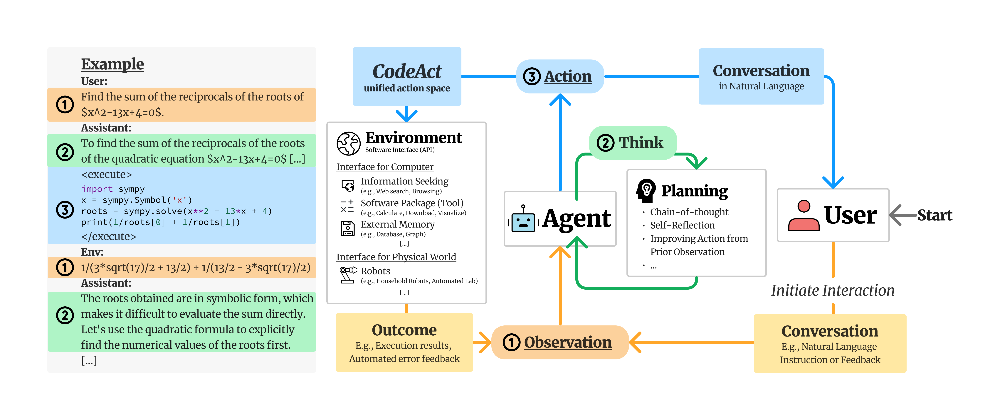
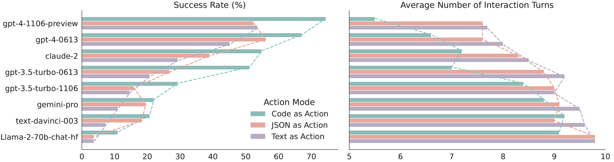
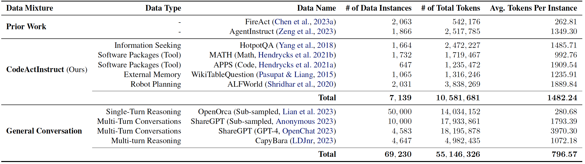
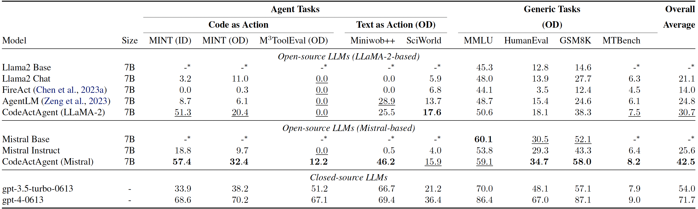

<h1 align="center"> Executable Code Actions Elicit Better LLM Agents </h1>

<p align="center">
<a href="TODO">📃 Paper</a>
•
<a href="https://huggingface.co/datasets/xingyaoww/code-act" >🤗 Data (CodeActInstruct)</a>
•
<a href="https://huggingface.co/xingyaoww/CodeActAgent-Mistral-7b-v0.1" >🤗 Model (CodeActAgent-Mistral-7b-v0.1)</a>
•
<a href="https://chat.xwang.dev/">🤖 Chat with CodeActAgent!</a>
</p>

We propose to use executable Python **code** to consolidate LLM agents’ **act**ions into a unified action space (**CodeAct**).
Integrated with a Python interpreter, CodeAct can execute code actions and dynamically revise prior actions or emit new actions upon new observations (e.g., code execution results) through multi-turn interactions (check out [this example!](https://chat.xwang.dev/r/Vqn108G)).



## Why CodeAct?

Our extensive analysis of 17 LLMs on API-Bank and a newly curated benchmark [M<sup>3</sup>ToolEval](docs/EVALUATION.md) shows that CodeAct outperforms widely used alternatives like Text and JSON (up to 20% higher success rate). Please check our paper for more detailed analysis!


*Comparison between CodeAct and Text / JSON as action.*


*Quantitative results comparing CodeAct and {Text, JSON} on M<sup>3</sup>ToolEval.*


## 📁 CodeActInstruct

We collect an instruction-tuning dataset CodeActInstruct that consists of 7k multi-turn interactions using CodeAct. Dataset is release at [huggingface dataset 🤗](https://huggingface.co/datasets/xingyaoww/code-act). Please refer to the paper and [this section](#-data-generation-optional) for details of data collection.



*Dataset Statistics. Token statistics are computed using Llama-2 tokenizer.*

## 🪄 CodeActAgent

Trained on **CodeActInstruct** and general conversaions, **CodeActAgent** excels at out-of-domain agent tasks compared to open-source models of the same size, while not sacrificing generic performance (e.g., knowledge, dialog). We release two variants of CodeActAgent:
- **CodeActAgent-Mistral-7b-v0.1** (recommended, [model link](https://huggingface.co/xingyaoww/CodeActAgent-Mistral-7b-v0.1)): using Mistral-7b-v0.1 as the base model with 32k context window.
- **CodeActAgent-Llama-7b** ([model link](https://huggingface.co/xingyaoww/CodeActAgent-Llama-2-7b)): using Llama-2-7b as the base model with 4k context window.


*Evaluation results for CodeActAgent. ID and OD stand for in-domain and out-of-domain evaluation correspondingly. Overall averaged performance normalizes the MT-Bench score to be consistent with other tasks and excludes in-domain tasks for fair comparison.*


Please check out [:page_with_curl: our paper](TODO) for more details about data collection, model training, evaluation, and more!


## 🚀 Use CodeActAgent for Your Application!

### Serve the Model using vLLM into OpenAI Compatible API

```bash
# You should download the model first, here is an example for CodeActAgent-Mistral
cd $YOUR_DIR_TO_DOWNLOADED_MISTRAL_MODEL
git lfs install
git clone https://huggingface.co/xingyaoww/CodeActAgent-Mistral-7b-v0.1
./scripts/chat/start_vllm.sh $YOUR_DIR_TO_DOWNLOADED_MISTRAL_MODEL/CodeActAgent-Mistral-7b-v0.1
# OR
# ./scripts/chat_ui/start_vllm.sh $YOUR_DIR_TO_DOWNLOADED_LLAMA_MODEL/CodeActAgent-Llama-7b
```

This script (docker-required) will start hosting the model based on `CUDA_VISIBLE_DEVICES` to port `8080` and you may access the model via OPENAI_API_BASE of `http://localhost:8080/v1` (by default). You may check the [OpenAI API's official documentation](https://platform.openai.com/docs/api-reference/chat/create) for detailed instruction. You may also check vLLM's [official instruction](https://vllm.ai/) for more information.

### Start your Code Execution Engine!

We implemented a containerized code execution engine based on [JupyterKernelGateway](https://github.com/jupyter-server/kernel_gateway). The idea is to start a Jupyter server inside a [docker container](scripts/chat_ui/code_execution/Dockerfile) *per chat session* to support code execution request from the model (the session will timeout in a fixed period of time). It requires docker to be installed locally.

```bash
# Start a code execution server at 8081
./scripts/chat/code_execution/start_jupyter_server.sh 8081
```

🌟 **Contribution welcomed**: We are still looking for a more scalable (and more secure) way to implement this (e.g., docker-in-docker, better management for pre-defined tools, support for web-browsing, file upload / management, etc) -- recommendations or PRs are welcomed!


### Interact with the system!

#### via simple Python script

If you don't want to spin-up a fancy interface and just want to play with it from the command line, we got you covered!

```bash
# Make sure you started vLLM and code execution engine before running this!
python3 scripts/chat/demo.py --model_name xingyaoww/CodeActAgent-Mistral-7b-v0.1 --openai_api_base http://$YOUR_VLLM_HOST:$YOUR_VLLM_PORT/v1 --jupyter_kernel_url http://$YOUR_CODE_EXEC_ENGINE_HOST:$YOUR_CODE_EXEC_ENGINE_PORT/execute
```


#### via Chat-UI

If you've served the model and the code execution engine, you can run your own chat interface just like [this](https://chat.xwang.dev)!

If you want user management, you may need to start your own mongoDB instance: 

```bash
./scripts/chat/start_mongodb.sh $YOUR_MONGO_DB_PASSWORD
# The database will be created at `pwd`/data/mongodb and available at localhost:27017
```

Then, you can configure your `chat-ui` interface.

```bash
cp chat-ui/.env.template chat-ui/.env.local
# Make sure you modify .env.local to your configuration by correctly fill-in
# 1. JUPYTER_API_URL
# 2. model endpoint (search for 'TODO_OPENAI_BASE_URL')
# 3. MONGODB_URL - You may leave this empty, the chat-ui will automatically start a database (but it will be deleted once the container is stopped)
```

Now you can build and start your own web application (docker-required)!
```bash
./scripts/chat/run_chat_ui.sh
# It will starts the interface on localhost:5173 by default

# Run this script for debug mode
# ./scripts/chat/run_chat_ui_debug.sh
```

For more information (e.g., if you don't want to use docker), please check-out chat-ui's [documentation](https://github.com/huggingface/chat-ui)!


## 🎥 Reproduce Experiments in the Paper

```bash
git clone https://github.com/xingyaoww/code-act
# To clone all submodules
git submodule update --init --recursive
```

### 📂 Data Generation (Optional)

**Recommended:** You may download the processed **CodeActInstruct** from [huggingface dataset 🤗](https://huggingface.co/datasets/xingyaoww/code-act).

**For reproducibility:** You can optionally generate data follow instructions in [docs/DATA_GENERATION.md](docs/DATA_GENERATION.md) to generate interaction data.

### 📘 Model Training

We use a fork of [Megatron-LLM](https://github.com/xingyaoww/Megatron-LLM) for training. You can follow [docs/MODEL_TRAINING.md](docs/MODEL_TRAINING.md) for detailed instructions.


### 📊 Evaluation 

Please refer to [docs/EVALUATION.md](docs/EVALUATION.md) for detailed instruction.

## 📚 Citation

```bibtex
TODO
```
